# LocalRAG Retrieval Pipeline — Exhaustive Reference

*Generated 2026-05-03. Source of truth: `ext/`, `compose/`, `scripts/`. Where this document disagrees with code, code wins.*

---

## 1. Big Picture

### Elevator pitch

At chat time, the retrieval pipeline takes three inputs — the user's raw query, the conversation history, and the set of knowledge bases the chat is scoped to — and produces a list of upstream-shaped source dicts: `[{"source": {...}, "document": [...], "metadata": [...]}, ...]`. Inside that list, from front to back, sit: (a) a live datetime preamble anchoring the LLM to the current wall-clock time; (b) a KB catalog preamble listing every successfully-ingested document the user's RBAC role allows; (c) one source dict per surviving chunk, their text wrapped in `<UNTRUSTED_RETRIEVED_CONTENT>` tags to defend against indirect prompt injection; and (d) nothing further. The LLM sees this as its `sources` input and answers. The pipeline must never raise — every failure is swallowed, logged at WARNING, and counted.

### The four intent classes

Intent classification is the load-bearing routing decision. It happens before any Qdrant call and determines which stages run and at what scale.

| Intent | Characterization | Example |
|---|---|---|
| `metadata` | User wants the catalog itself, not content | "What files do you have?", "How many reports are in the KB?" |
| `global` | Cross-document aggregation over the corpus | "Summarize all reports", "Compare trends across all brigades" |
| `specific_date` | Pinpoints a named calendar date | "Gun area outages of 5 Jan 2026", "What did the 03 Feb report say?" |
| `specific` | Everything else — content-anchored single-doc queries | "What happened during the 75 Inf Bde visit?" |

`metadata` skips all chunk retrieval: the catalog preamble alone answers the query. `global` queries retrieve only `level=doc` summary points (one per document), skip rerank and MMR (summaries are self-contained), and receive a wider budget (`RAG_GLOBAL_BUDGET_TOKENS=22000`). `specific_date` narrows retrieval by doc ID derived from a filename-date match before the Qdrant call. `specific` runs the full pipeline.

### The two entry surfaces

**Simple retrieve** (`POST /api/rag/retrieve`, `ext/routers/rag.py`): direct fan-out with RBAC check. No intent classification, no query rewrite, no SSE progress. Used by dev tooling and the admin health endpoint.

**Chat-completion middleware path** (`ext/services/chat_rag_bridge.py:retrieve_kb_sources`): the full bridge, called from upstream's `process_chat_payload()` via the patched middleware. Runs intent classification, query rewrite (flag-gated), decompose, rerank, MMR, expand, budget, spotlight, catalog, datetime, and SSE progress callbacks.

---

## 2. Flow Diagram

```mermaid
flowchart TD
    A([Chat middleware calls\nretrieve_kb_sources]) --> B[Active session gauge inc\nrequest_id_var / user_id_var set]
    B --> C[Total-pipeline timeout wrapper\nRAG_TOTAL_BUDGET_SEC default 30s]
    C --> D{RAG_DISABLE_REWRITE != 1\nAND history?}
    D -- yes --> E[Query rewrite\nquery_rewriter.rewrite_query\nCHAT_MODEL or REWRITE_MODEL]
    D -- no --> F[RBAC check\nrbac.resolved_allowed_kb_ids\nRedis DB 3 TTL 30s]
    E --> F

    subgraph QUERY_UNDERSTANDING [Query Understanding]
        F --> G[Per-KB rag_config merge\nkb_config.merge_configs\nflags.with_overrides]
        G --> H[Intent classify — regex fast path\nquery_intent.classify_with_reason\n<1ms no I/O]
        H --> I{RAG_QU_ENABLED=1?}
        I -- yes --> J[QU LLM hybrid\n_classify_with_qu\nvllm-qu qwen3-4b-qu\nRedis DB 4 cache TTL 300s]
        I -- no --> K[Intent flag overlay\n_INTENT_FLAG_POLICY\nRAG_INTENT_OVERLAY_MODE]
        J --> K
    end

    subgraph CANDIDATE_GATHERING [Candidate Gathering]
        K --> L{intent == metadata?}
        L -- yes --> M[Skip retrieve\ncatalog preamble answers]
        L -- no --> N{intent == specific_date?}
        N -- yes --> O[Date doc-id lookup\n_lookup_doc_ids_by_date\nPostgreSQL ILIKE]
        N -- no --> P[Set level_filter\nglobal: doc\nspecific: chunk\ndefault: none]
        O --> P
        P --> Q{RAG_MULTI_ENTITY_DECOMPOSE=1\nAND entities >= 2?}
        Q -- yes --> R[Multi-entity fan-out\n_multi_entity_retrieve\none retrieve per entity\nascyncio.gather]
        Q -- no --> S[Embed query\nembedder.embed via TEI\noptional HyDE RAG_HYDE\noptional SemCache RAG_SEMCACHE]
        S --> T[Parallel per-KB retrieve\nretriever.retrieve\nasyncio.gather per KB + chat_private\nhybrid dense+sparse RRF k=60\noptional ColBERT RAG_COLBERT]
        R --> T
        T --> U[Global drilldown\nRAG_GLOBAL_DRILLDOWN default 1\nfan chunk-retrieve per doc_id\ncap RAG_GLOBAL_DRILLDOWN_K=2]
    end

    subgraph SCORING [Scoring and Diversification]
        U --> V[Cross-KB merge\nretriever.merge_kb_results\nRRF rerank-off / score-sort rerank-on]
        M --> V
        V --> W{RAG_RERANK=1\nAND not global?}
        W -- yes --> X[Cross-encoder rerank\ncross_encoder_reranker.score\nbge-reranker-v2-m3 GPU 1\ncache 300s]
        W -- no --> Y[Heuristic rerank\nreranker.rerank\nmax-norm per KB]
        X --> Z[RAG_RERANK_MIN_SCORE filter\noptional threshold drop]
        Y --> Z
        Z --> AA{RAG_MMR=1\nAND not global?}
        AA -- yes --> AB[MMR diversification\nmmr.mmr_rerank_from_hits\nλ=RAG_MMR_LAMBDA default 0.7\ncap RAG_MMR_MAX_INPUT_SIZE default 50]
        AA -- no --> AC[Per-entity quota trim\n_apply_entity_quota\nRAG_MULTI_ENTITY_RERANK_FLOOR default 3]
        AB --> AD[Coverage counter\n_bump_coverage_counter\nfull/partial/empty]
        AC --> AD
        AD --> AE{RAG_CONTEXT_EXPAND=1\nAND not global?}
        AE -- yes --> AF[Context expand\ncontext_expand.expand_context\nQdrant scroll ±N siblings\ncap RAG_CONTEXT_EXPAND_MAX_HITS]
        AE -- no --> AG
        AF --> AG[Token budget\nbudget.budget_chunks\nRAG_BUDGET_TOKENS 10K / 22K global\nRAG_BUDGET_TOKENIZER=gemma-4]
    end

    subgraph PACKAGING [Packaging]
        AG --> AH{RAG_SPOTLIGHT=1?}
        AH -- yes --> AI[Spotlight wrap\nspotlight.wrap_context\nUNTRUSTED_RETRIEVED_CONTENT tags\ndefang nested closes]
        AH -- no --> AJ
        AI --> AJ[Format sources\ngroup by doc_id\nupstream dict shape]
        AJ --> AK[KB catalog preamble\n_build_kb_catalog\nPostgres kb_documents ingest_status=done\ncap RAG_KB_CATALOG_MAX=500]
        AK --> AL[Datetime preamble\n_build_datetime_preamble_source\nRAG_INJECT_DATETIME default 1\nRAG_TZ=UTC]
        AL --> AM[Calibrated abstention prefix\ncompute_abstention_prefix\nRAG_ENFORCE_ABSTENTION\nRAG_ABSTENTION_THRESHOLD default 0.1]
        AM --> AN[SSE done event\n_emit progress_cb\n_log_rag_query JSON line\nactive_sessions dec]
        AN --> AO([Return sources_out list])
    end
```



---

## 3. Per-Stage Detail

### Stage 1 — Active session counter + request context

**Function:** `retrieve_kb_sources` / `_retrieve_kb_sources_inner` — `ext/services/chat_rag_bridge.py:1181-1271`

**What it does:** Increments `rag_active_sessions` gauge on entry; sets `request_id_var` (UUID4 8-char prefix) and `user_id_var` as Python `contextvars.ContextVar` for structured log correlation. Decrements the gauge in a `try/finally` on exit.

**Inputs/outputs:** User-provided `kb_config`, `query`, `user_id`, `chat_id`, `history`, `progress_cb`. Returns `List[dict]`.

**Gating:** Always runs.

**Defaults:** `request_id_var` defaults to `"-"` before being set (so a test that bypasses setup logs `-` not a crash).

**Failure mode:** `_record_silent_failure("session_gauge_inc", err)` — gauge failure never kills the request. Stage label `session_gauge_inc` / `session_gauge_dec` in `rag_silent_failure_total`.

**Observability:** `rag_active_sessions` gauge (real-time concurrent session count); log line `"rag: request started req=... user=... kbs=... chat=..."`.

---

### Stage 2 — Total-pipeline timeout

**Function:** `_retrieve_kb_sources_inner` — `ext/services/chat_rag_bridge.py:1356-1403`

**What it does:** Wraps `_run_pipeline` in `asyncio.wait_for(timeout=_budget_sec)`. On `TimeoutError`, returns a degraded list containing only the datetime preamble (catalog is omitted because its DB read may itself be the cause).

**Inputs/outputs:** `_total_budget_seconds()` reads `RAG_TOTAL_BUDGET_SEC` (default `30`).

**Gating:** Always active.

**Defaults:** 30 seconds. Read at request time via `_total_budget_seconds()` at `ext/services/chat_rag_bridge.py:631` so an operator can dial it without a restart.

**Failure mode:** `rag_pipeline_timeout_total{intent}` counter; SSE event `{"stage": "error", "message": "pipeline_timeout"}`. The LLM still gets the datetime preamble — it can answer "what's today" but not KB questions.

**Observability:** `rag_pipeline_timeout_total` counter labelled by `intent`. Any non-zero rate warrants immediate investigation — it means a downstream service is hung.

---

### Stage 3 — Optional query rewrite

**Function:** `_retrieve_kb_sources_inner` calls `query_rewriter.rewrite_query()` — `ext/services/chat_rag_bridge.py:1256-1264`; implementation at `ext/services/query_rewriter.py`

**What it does:** When `RAG_DISABLE_REWRITE != "1"` AND conversation `history` is non-empty, calls the chat LLM (default `REWRITE_MODEL` env or `CHAT_MODEL`) to collapse pronouns and conversation context into a standalone query. Example: "What about the February report?" with history referencing January → "What does the February report say about X?".

**Inputs/outputs:** `latest_turn` (user message), `history` (prior turns), chat LLM URL + model. Returns the rewritten string; on failure returns the original.

**Gating:** `RAG_DISABLE_REWRITE=1` (default) means this stage is a no-op and the code path is byte-identical to pre-P0.5. Per-KB `rag_config` cannot currently override this; it is process-level only.

**Defaults:** OFF (`RAG_DISABLE_REWRITE=1`).

**Failure mode:** Soft-fail — any LLM error falls through to the original query. No silent-failure counter at this stage; rewrite errors surface in the LLM-call logs.

**Performance:** One LLM round-trip (~200-800 ms depending on vllm-chat load). Only pays cost when history is present and flag is flipped.

**Gotcha:** `REWRITE_MODEL` is not currently listed in `compose/.env.example` env block — must be added to the service's `environment:` section in `compose/docker-compose.yml` to take effect.

---

### Stage 4 — RBAC check

**Function:** `rbac.resolved_allowed_kb_ids()` — `ext/services/rbac.py`; called at `ext/services/chat_rag_bridge.py:1300-1327`

**What it does:** Returns the set of KB IDs the requesting user is allowed to read. Cache-first: checks Redis DB 3 with key `rbac:user:{user_id}`, TTL `RAG_RBAC_CACHE_TTL_SECS` (default `30`). Cache miss falls through to Postgres. Pubsub channel `rbac:invalidate` triggers immediate eviction on access-grant changes.

**Inputs/outputs:** `user_id` (str), `AsyncSession`. Returns `set[int]`.

**Gating:** Only if `kb_config` is non-empty. Chat-private path bypasses KB RBAC.

**Defaults:** TTL 30 seconds. DB is always the source of truth — cache miss always falls through. Fail-closed: a Postgres error re-raises (does NOT soft-fail), so a broken DB denies rather than grants.

**Failure mode:** Re-raises on DB error (fail-closed). Redis outage causes every request to fall through to Postgres — functional but slower. Pubsub subscriber failure means revocations only take effect after TTL expiry. Log: `"rbac subscriber: started"` on startup; missing log = subscriber is down. Counter: `rag_rbac_denied_total{route}`.

**Observability:** OTel span `rag.rbac_check` with attributes `user_id`, `requested_kb_count`, `allowed_kb_count`. Counter `rag_rbac_cache_inval_failed_total` for pubsub publish failures.

---

### Stage 5 — Per-KB rag_config merge

**Function:** `_load_kb_rag_configs()` + `kb_config.merge_configs()` + `config_to_env_overrides()` — `ext/services/chat_rag_bridge.py:1335-1354`; merge logic at `ext/services/kb_config.py`

**What it does:** Fetches each selected KB's `rag_config` JSONB from Postgres. Merges across all selected KBs using a UNION/MAX (strictest-wins) policy: if any KB requests `rerank=true`, the whole request runs rerank. Numeric values (e.g. `context_expand_window`) take the maximum. Converts the merged config to a `{RAG_*: "0"|"1"|"N"}` dict and wraps the pipeline in `flags.with_overrides(...)` — this scopes the overlay to the current request without touching the shared process `os.environ`.

**Inputs/outputs:** List of `kb_id`s, DB session. Returns dict mapping env-var names to string values.

**Gating:** Always runs when KBs are selected. Ingest-only keys (`contextualize`, `chunking_strategy`, `chunk_tokens`, `overlap_tokens`, `image_captions`, `doc_summaries`) are stripped — they do not affect the retrieval overlay.

**Defaults:** Empty config = inherit process defaults. On DB error, returns empty list and falls through to process defaults (fail-open, logged as `kb_rag_config_load`).

**Failure mode:** `_record_silent_failure("kb_rag_config_load", e)` — retrieval still runs with process-level env defaults. This is an important observable: a Postgres schema drift or connection spike that breaks this silently degrades every multi-KB quality boost.

**Observability:** `rag_silent_failure_total{stage="kb_rag_config_load"}` counter.

---

### Stage 6 — Intent classify (regex fast-path)

**Function:** `query_intent.classify_with_reason()` — `ext/services/query_intent.py:310+`; called at `ext/services/chat_rag_bridge.py:1511-1525`

**What it does:** Lowercases the query, applies ordered regex patterns for `metadata` and `global` labels, then falls back to `specific`. Also tries `specific_date` via `extract_date_tuple()` — if a parseable date is found (`D Mon YYYY` or `YYYY-MM-DD` or `Mon D YYYY`), routes to `specific_date`. The B11/B12 fix (`7a89d25`) tightened the `metadata` vs `specific_date` boundary: a query with an explicit date anchor phrase (`"summary of 5 Jan"`) now routes `specific_date` even if `global:summary_of` would otherwise match.

**Inputs/outputs:** `query: str` → `(intent: str, reason: str)`.

**Gating:** Always runs. The regex path is unconditional; the LLM path (Stage 7) is additive.

**Defaults:** Falls back to `"specific"` with reason `"default:no_pattern_matched"` when no pattern matches. This fallback reason is itself an escalation trigger for Stage 7.

**Failure mode:** Pure function — no I/O, no failure path. Sub-millisecond.

**Gotcha:** The module-level `classify_intent()` (line 90) is the deprecated synchronous version kept for backward compatibility. New call sites should use `classify_with_reason()` from `query_intent.py`.

**Observability:** No dedicated counter. Intent label flows into `rag_query` log line and `rag_retrieval_empty_total{intent}`.

---

### Stage 7 — Intent classify (QU LLM hybrid)

**Function:** `_classify_with_qu()` — `ext/services/chat_rag_bridge.py:224-277`; underlying call to `query_intent.classify_with_qu()` at `ext/services/query_intent.py`

**What it does:** Wraps the QU LLM (Qwen3-4B-AWQ on vllm-qu) as a hybrid classifier. Escalates from regex to LLM when one of six predicates fires (in fixed order so shadow logging is deterministic): (1) pronoun reference with history present, (2) relative time expression, (3) multi-clause connector with >8 tokens, (4) long query >25 tokens, (5) comparison verb, (6) question word with no capitalized entity. Also always escalates when the regex hit the default-fallback rule (`regex_reason == "default:no_pattern_matched"`). The LLM result (JSON schema via xgrammar guided decoding) carries `intent`, `resolved_query`, `temporal_constraint`, `entities`, and `confidence`. Cache key: `(query, last_turn_id)` in Redis DB 4, TTL 300s. When `RAG_QU_SHADOW_MODE=1`, both regex and LLM results are written to `RAG_QU_SHADOW_LOG_PATH` for offline A/B analysis.

**Inputs/outputs:** `query: str`, `history: list[dict]`, `last_turn_id: str` → `HybridClassification` dataclass.

**Gating:** `RAG_QU_ENABLED` (default `0` — in 7-day shadow soak as of 2026-05-03). Cache gated by `RAG_QU_CACHE_ENABLED` (default `1`). Cache uses Redis DB 4 (`RAG_QU_REDIS_DB=4`).

**Defaults:** When `RAG_QU_ENABLED=0`, `_classify_with_qu` runs but the `source` field will be `"regex"` and `resolved_query` will equal the original query — byte-identical to the pre-QU path.

**Failure mode:** Soft-fail — any LLM timeout/error/schema violation falls back to regex. Stage label `qu_cache_init` in `rag_silent_failure_total`. `rag_qu_schema_violations_total` counter fires on bad JSON. `rag_qu_invocations_total{source}` counts regex/llm/cached paths separately.

**Performance:** QU LLM call targets <600ms p95 (SLO in `observability/prometheus/alerts-qu.yml`). Cache hit avoids the round-trip entirely.

**Observability:** `rag_qu_invocations_total`, `rag_qu_escalations_total{reason}`, `rag_qu_latency_seconds` histogram, `rag_qu_schema_violations_total`, `rag_qu_cache_hits_total`, `rag_qu_cache_misses_total`, `rag_qu_cache_hit_ratio` gauge. OTel span `rag.intent_classify` with attributes `intent`, `source`, `confidence`, `cached`, `escalation_reason`. Alert `QULLMHighLatency` fires when p95 > 600ms for 10m.

---

### Stage 8 — Intent flag overlay

**Function:** `resolve_intent_flags()` / `_INTENT_FLAG_POLICY` — `ext/services/chat_rag_bridge.py:298-362`

**What it does:** Applies intent-conditional defaults for `RAG_MMR` and `RAG_CONTEXT_EXPAND` on top of any per-KB `rag_config` overrides. Policy at line 298: `specific` and `specific_date` get `MMR=0, CONTEXT_EXPAND=1`; `global` gets `MMR=1, CONTEXT_EXPAND=0`; `metadata` gets both off. These are base defaults — per-KB `rag_config` always wins over them.

**Gating:** `RAG_INTENT_OVERLAY_MODE` (default `"intent"`). When set to `"env"`, intent defaults are dropped for keys already set in the process env so the operator's explicit env value shows through. Per-KB `rag_config` overrides win in both modes.

**Defaults:** `intent` mode — intent policy applies. Intent-conditional shaping happens silently with no operator action required.

**Failure mode:** Pure function — no I/O. Unknown intents fall back to `specific` policy.

**Gotcha:** This stage runs BEFORE `_run_pipeline` and BEFORE the `asyncio.wait_for` wrapper. The resulting `merged_overrides` dict is passed to `flags.with_overrides()` which scopes the overlay to the running request. Direct `os.environ.get(...)` calls inside the pipeline (e.g. in `budget.py`) read the process env, not the overlay — use `flags.get(...)` everywhere on the hot path.

---

### Stage 9 — Date doc-id lookup

**Function:** `_lookup_doc_ids_by_date()` — `ext/services/chat_rag_bridge.py:571-624`

**What it does:** For `specific_date` intent, extracts the date tuple `(day, month_abbr, year)` via `extract_date_tuple()` then queries `kb_documents` with a case-insensitive PostgreSQL regex (`~*`) to find documents whose filename matches the date. The regex uses `\y` (PostgreSQL ARE word boundary, NOT Perl `\b`) to avoid false matches. Handles zero-padded days, 2/4-digit years, double-space variants.

**Inputs/outputs:** `kb_ids: list[int]`, `date_tuple: (int, str, int)` → `list[int]` of matching `doc_id`s.

**Gating:** Only when `_intent == "specific_date"` after Stage 7.

**Defaults:** Returns empty list when `_sessionmaker` is unconfigured, `kb_ids` is empty, date not parsed, no filename matches, or DB error. Caller falls through to generic `specific` retrieval.

**Failure mode:** `_record_silent_failure("date_doc_lookup", e)` — demotes intent to `specific` silently. The original `\b`→`\y` confusion caused zero rows to be returned from PostgreSQL even though Python tests passed; confirmed 2026-04-xx during initial Plan B work. Always use `\y` in PG ARE regexes.

**Observability:** `rag_silent_failure_total{stage="date_doc_lookup"}`. Log line `"rag: specific_date matched N doc(s) for ..."` on success; `"rag: specific_date → specific (no filename match ...)"` on fallback.

---

### Stage 10 — Embed query

**Function:** `embedder.embed([query])` — called inside `retriever.retrieve()`, `ext/services/retriever.py:306-308`; TEI client at `ext/services/embedder.py`

**What it does:** Encodes the query string (post-QU resolution if LLM was used; otherwise raw) into a 1024-dimensional dense vector via TEI (bge-m3). For HyDE (Stage 11) the hypothetical embeddings are averaged instead. Returns `[qvec]`, a list with one vector.

**Inputs/outputs:** `list[str]` → `list[list[float]]`.

**Gating:** Always runs (unless HyDE returns a pre-computed vector).

**Defaults:** TEI at `EMBED_URL` (default `http://tei:8080`).

**Failure mode:** On 424 (CUDA OOM) or other 5xx, the embedder retries up to `RAG_EMBED_MAX_RETRIES` times, then halves the batch and recurses down to batch=1. `embedder_retry_total{outcome, reason}` and `embedder_halving_total{batch_size_class}` counters track this (added 2026-05-03, commit `329ccf5`). A sustained `batch_size_class="1"` is a smell — TEI can't handle even a single chunk.

**Performance:** ~5-15ms for a single query embed on bge-m3. Bottleneck is TEI GPU forward pass on GPU 1 (24 GB shared).

**Observability:** OTel span `embed.query` wraps the entire retrieve including the embed call.

---

### Stage 11 — HyDE (Hypothetical Document Embeddings)

**Function:** `hyde.hyde_embed()` — `ext/services/hyde.py`; called at `ext/services/retriever.py:293-308`

**What it does:** Generates `RAG_HYDE_N` (default 1) synthetic "excerpt" answers via the chat LLM, embeds each, averages them. The averaged vector matches real document chunks (written as declarative statements) better than an interrogative query embedding. Parallel generation when N>1; wall-time cost roughly constant.

**Gating:** `RAG_HYDE=1` (default off); also overridable per-KB via `rag_config.hyde=true`. Global intent forces `RAG_HYDE=0` (HyDE's hypothetical answers look like chunk content and bias away from doc-summary cluster).

**Failure mode:** `hyde_embed` returns `None` on any LLM error → falls through to raw query embed. Fail-open with no silent-failure counter at this stage.

**Performance:** N chat LLM round-trips (parallel) + one TEI embed call. If N=1, adds ~500-1500ms of LLM latency on vllm-chat.

---

### Stage 12 — SemCache

**Function:** `retrieval_cache.get()` / `retrieval_cache.set()` — `ext/services/retrieval_cache.py`; checked at `ext/services/retriever.py:314-325`

**What it does:** Looks up a quantized vector key in Redis before any Qdrant call. Key encodes `pipeline_version + KB selection + quantized_qvec` (so near-identical queries share one cache entry). On hit, skips the Qdrant fan-out entirely and returns the cached hit list.

**Gating:** `RAG_SEMCACHE=1` (default off).

**Failure mode:** Lazy import — on cache error the flag is effectively treated as `0`. Fail-open.

---

### Stage 13 — Multi-entity decompose

**Function:** `_multi_entity_retrieve()` — `ext/services/chat_rag_bridge.py:1042-1178`; entity extraction at `ext/services/entity_extractor.py`; sub-query building at `ext/services/multi_query.py`

**What it does:** When the query names 2+ distinct entities (brigades, parties, organizations), fans out one parallel `retrieve()` call per entity with a focus-shifted sub-query: `"<base> (focus on <entity>)"`. Per-entity floor from `RAG_MULTI_ENTITY_MIN_PER_ENTITY` (default 10, bounded [1, 50]). Method 4 (`RAG_ENTITY_TEXT_FILTER=1`) additionally passes `text_filter=entity` as a Qdrant `MatchText` filter — but see "critical paths" below for why this is currently off on KB 2.

**Inputs/outputs:** `entities: list[str]`, `base_query`, KB config, Qdrant → merged hit list.

**Gating:** `RAG_MULTI_ENTITY_DECOMPOSE=1` (default off); `should_decompose()` additionally requires intent not to be `metadata` or `global`. Per-KB via `rag_config.multi_entity_decompose=true`.

**Defaults:** OFF. Single `retrieve()` call unchanged.

**Failure mode:** Per-entity sub-call failures are silently caught (`_record_silent_failure("multi_entity.retrieve[...]")`) and contribute empty lists to the merge. Method 4 fail-open: when the text-filtered sub-call returns 0 hits, it retries without the filter and increments `rag_entity_text_filter_total{outcome="filter_empty_retry"}`.

**Performance:** N parallel Qdrant round-trips (1 per entity) via `asyncio.gather`. With 4 entities and hybrid search, wall-time is similar to one search (parallel) plus the merge.

**Observability:** `rag_multi_query_decompose_total{outcome}`, `rag_entity_text_filter_total{outcome}`, `rag_entity_extract_total{source}`, `rag_entity_extract_count` histogram. Log line: `"rag: multi-entity decompose entities=N filter=X floor=Y total=Z -> M hits"`.

---

### Stage 14 — Parallel per-KB retrieve

**Function:** `retriever.retrieve()` — `ext/services/retriever.py:232-497`; fan-out via `asyncio.gather` at line 483

**What it does:** For each selected KB, calls `vector_store.hybrid_search()` (when `RAG_HYBRID=1`, default on) combining dense TEI vector + fastembed BM25 sparse with RRF k=60. When `RAG_COLBERT=1`, adds ColBERT multi-vector for tri-fusion. Filters applied in each call: `subtag_ids`, `doc_ids` (for `specific_date`), `level` (for intent routing), `shard_keys` (for temporal sharding), `text_filter` (Method 4), `owner_user_id` (chat-private isolation). Also searches `chat_private` collection (and legacy `chat_{chat_id}` for backward compatibility) in parallel.

**Inputs/outputs:** `query`, `selected_kbs`, `chat_id`, `vector_store`, `embedder`, `per_kb_limit`, `total_limit` → `List[Hit]`.

**Gating:** `RAG_HYBRID=1` (default on, +12pp chunk_recall at +3ms vs dense-only per eval). `RAG_COLBERT=1` (default off, production on). Shard-key filter only when `RAG_TEMPORAL_LEVELS=1` AND temporal_constraint is set.

**Limits:** Default 10/KB, 30 total (`specific`); 30/KB, 60 total (`specific_date`); 50/KB, 100 total (`global`). Multi-temporal boost: 12×N_shards per KB, 12×N×N_KBs total.

**Failure mode:** Per-KB search failures are caught by `_record_silent_failure("retrieve.per_kb_search", exc)`. When the error looks like a Qdrant 401/403 (detected by `_is_qdrant_auth_error()`), logging is escalated from WARNING to ERROR and a second counter label `retrieve.per_kb_search.auth_error` is also incremented (commit `6384b89`). This was the mechanism that made the Qdrant auth disaster (see Section 6) detectable.

**Performance:** Qdrant search latency tracked by `rag_qdrant_search_latency_seconds{collection}`. Typical: 5-25ms per KB for HNSW ef=128. Bottleneck: HNSW graph traversal scales with ef parameter.

**Observability:** OTel spans `qdrant.search` (per collection) nested under `retrieve.parallel` nested under `rag.retrieve`. `rag_retrieval_hits_total{kb_count, kb_primary, path}` counter. Auth errors: `rag_silent_failure_total{stage="retrieve.per_kb_search.auth_error"}`.

---

### Stage 15 — Shard-key filter

**Function:** Applied inside `vector_store.search()` / `hybrid_search()` — `ext/services/vector_store.py`

**What it does:** When `RAG_TEMPORAL_LEVELS=1` AND the QU LLM returned a `temporal_constraint`, derives shard keys via `_shard_keys_for_constraint()` and injects a Qdrant `MatchAny(shard_key)` filter. Custom-sharded collections (e.g. `kb_1_v4` with monthly buckets) restrict the candidate pool to the matching month(s). Non-sharded collections silently ignore the filter (no point carries a `shard_key` payload, so the MatchAny falls through).

**Gating:** `RAG_TEMPORAL_LEVELS=1` (default off) AND QU result must have `source=="llm"` (no temporal constraint from regex).

---

### Stage 16 — Level filter

**Function:** Applied in `retriever._search_kb()` — `ext/services/retriever.py:431-436`

**What it does:** Post-filters Qdrant results in Python to keep only hits whose `payload["level"]` matches the requested level. `level="doc"` for `global` intent (doc-summary points), `level="chunk"` for `specific` when `RAG_INTENT_ROUTING=1`. Hits without a `level` field are treated as `"chunk"` by convention (backward compatibility for pre-doc-summary collections).

**Gating:** `level_filter` is set at `ext/services/chat_rag_bridge.py:1664-1670`: `"doc"` for global, `"chunk"` for specific+routing, `None` (no filter) otherwise.

---

### Stage 17 — Cross-KB merge

**Function:** `retriever.merge_kb_results()` — `ext/services/retriever.py:147-216`

**What it does:** Combines per-KB hit buckets into one ranked list. When `RAG_RERANK=1`: global sort by Qdrant score (the cross-encoder will re-score anyway). When `RAG_RERANK=0`: Reciprocal Rank Fusion (RRF) by within-KB rank, preventing a high-score chatty KB from dominating. Dedup key: `(kb_id, doc_id, chunk_index_or_level)` — the `DOC:{level}` slot (added in `§5.12`) prevents doc-summary and RAPTOR-level points for the same doc from colliding on the `chunk_index=None` key.

---

### Stage 18 — Rerank

**Function:** `reranker.rerank_with_flag()` → `cross_encoder_reranker.score()` — `ext/services/reranker.py:87+`; cross-encoder at `ext/services/cross_encoder_reranker.py`

**What it does:** When `RAG_RERANK=1` (and intent is not `global`), scores each `(query, passage)` pair with `bge-reranker-v2-m3` (sentence-transformers cross-encoder on GPU 1). Scores are cached in Redis for 300s via `ext/services/rerank_cache.py`. Score cache outcome: `rag_rerank_cache_total{outcome="hit"|"miss"}`. Heuristic fallback (`RAG_RERANK=0`): per-KB max-normalize scores, then global sort — avoids a high-score collection dominating.

**Gating:** `RAG_RERANK=1` (default off; production ON). Global intent short-circuits to score-sort only — no cross-encoder call.

**Defaults:** Heuristic rerank. Fast-path in `_rerank_impl()`: if `top1_score >= 2.0 × top2_score` (top hit clearly dominates), returns input unchanged.

**Failure mode:** Fail-open via `rerank_with_flag`'s try/except: on any cross-encoder error, falls back to heuristic. `_record_silent_failure("rerank_fallback", ...)`.

**Performance:** Cross-encoder inference ~50-200ms for top-30 input on GPU 1. Bottleneck: transformer forward pass; shared GPU with TEI/vllm-qu/fastembed.

**Post-filter:** `RAG_RERANK_MIN_SCORE` (unset = off). When set, drops hits below threshold; `rag_rerank_threshold_dropped_total{intent}` counts each dropped hit. Use with care — a ramp here signals corpus/model drift if it wasn't expected.

**Observability:** OTel span `rerank.score` with `n_candidates`, `model`, `top_k`. `rag_stage_latency_seconds{stage="rerank"}` histogram. `rag_rerank_cache_total`.

---

### Stage 19 — Per-entity rerank quota

**Function:** `_apply_entity_quota()` — `ext/services/chat_rag_bridge.py:930-1025`; called at lines 2202 (no-MMR trim), 2161 (MMR-fail trim), 2137 (MMR-success trim)

**What it does:** After cross-encoder reranking, the plain `reranked[:final_k]` trim is entity-blind and can evict low-frequency entities entirely (the "75 Inf Bde / 5 PoK Bde smoke test" showed 0 grounded bullets for weaker brigades before this fix). `_apply_entity_quota` runs a quota pass: for each entity, picks up to `RAG_MULTI_ENTITY_RERANK_FLOOR` (default 3) chunks that mention the entity (case-insensitive substring). Then fills remaining slots from the cross-encoder-ordered tail. Outputs a list sorted by score descending, capped at `final_k`.

**Gating:** Only when `_do_decompose=True`, `_entities` is non-empty, and `_entity_floor > 0`.

**Defaults:** `RAG_MULTI_ENTITY_RERANK_FLOOR=3`. Set to 0 to disable and restore entity-blind trim.

**Failure mode:** Pure function — no I/O. Falls back to `reranked[:final_k]` when entities are empty or floor is 0.

**Observability:** `rag_multi_entity_rerank_quota_total{outcome="applied"|"skipped"}` (three call sites, mutually exclusive). Log line: `"rag: multi-entity rerank quota active — entities=N floor=F final_k=K"`.

---

### Stage 20 — MMR

**Function:** `mmr.mmr_rerank_from_hits()` — `ext/services/mmr.py`; called at `ext/services/chat_rag_bridge.py:2117`

**What it does:** Maximal Marginal Relevance diversification. Selects a sequence of hits that maximises `lambda × sim(query, hit) - (1-lambda) × max_sim(hit, already_selected)`. Reuses stored dense vectors when `with_vectors=True` (avoiding a TEI re-embed round-trip for the MMR computation). Pre-normalizes vectors once at entry and uses `np.dot` for cosine similarity (reviewed §5.10). Capped to `RAG_MMR_MAX_INPUT_SIZE` (default 50) to avoid OOM when multi-entity decompose produces 200+ candidates.

**Gating:** `RAG_MMR=1` AND intent not `global` (global skips MMR — doc summaries are already one-per-document, no diversity gain). Intent flag overlay sets `MMR=1` for global queries automatically — but the code then disables it for global at line 2029.

**Defaults:** OFF globally; ON for `global` intent via intent overlay (but then blocked by the global short-circuit). Production: `RAG_MMR=1` in `compose/.env`.

**Failure mode:** `_record_silent_failure("mmr_rerank", err)` → falls back to reranker output. If `RAG_MMR_FAIL_TRIM=1`, trims the cross-encoder output to `final_k` (prevents 50-candidate × 3-sibling explosion in context expand). MMR-fail also triggers the coverage counter via `_apply_entity_quota` on the fail-trim path.

**Performance:** One TEI re-embed round-trip (all passages batched). ~50-200ms for top-20 input. Bottleneck: GPU 1 shared with reranker/TEI/vllm-qu.

**Observability:** `rag_stage_latency_seconds{stage="mmr"}` histogram. OTel span `mmr_rerank`.

---

### Stage 21 — Coverage counter

**Function:** `_bump_coverage_counter()` — `ext/services/chat_rag_bridge.py:883-927`

**What it does:** For multi-entity queries, counts how many chunks in the final slice mention each extracted entity. Fires at three mutually exclusive call sites: (1) no-MMR trim path (line 2202), (2) MMR-fail trim path (line 2161), (3) MMR-success path (line 2138, added 2026-05-03 Task 16 to close the observability gap). Categorizes outcome as `full` (all entities met their floor), `partial` (some got <floor but >0), or `empty` (at least one got 0 chunks — the failure mode the spec was written to fix).

**Observability:** `rag_multi_entity_coverage_total{outcome, entity_count}`. Alert `MultiEntityCoverageEmpty` fires when `outcome=empty` rate >5% over 10m.

---

### Stage 22 — Context expand

**Function:** `context_expand.expand_context()` — `ext/services/context_expand.py`; called at `ext/services/chat_rag_bridge.py:2246-2291`

**What it does:** For each top hit, fetches its `±RAG_CONTEXT_EXPAND_WINDOW` (default 1) siblings from Qdrant via scroll, returning adjacent chunks from the same document. The LLM sees coherent paragraphs rather than isolated fragments. Cap: `RAG_CONTEXT_EXPAND_MAX_HITS` (default 0 = unlimited). When cap is >0, only the first N hits are expanded; the tail passes through unchanged.

**Gating:** `RAG_CONTEXT_EXPAND=1` AND intent not `global`. Intent flag overlay sets `CONTEXT_EXPAND=1` for `specific` and `specific_date` automatically.

**Defaults:** OFF globally; production: ON.

**Failure mode:** `_record_silent_failure("context_expand", err)` → keeps reranker/MMR output unchanged.

**Performance:** One Qdrant scroll call per hit (2N+1 points fetched per hit). With window=1 and 12 hits = 12 scroll calls, ~100-300ms total. With no cap and 50 MMR-fail candidates this multiplies to potentially 50 × 3 = 150 points fetched — which is why `RAG_CONTEXT_EXPAND_MAX_HITS` exists.

**Observability:** `rag_stage_latency_seconds{stage="expand"}` histogram. SSE event `{"stage": "expand", "siblings_fetched": N}`.

---

### Stage 23 — Time decay

**Function:** `ext/services/time_decay.py`

**What it does:** Placeholder. The module exists and `RAG_TIME_DECAY` env var is defined, but per code audit the time decay stage is NOT currently wired into `_run_pipeline`. The `ext/services/time_decay.py` module contains the scoring logic but there is no call site in the hot path.

**Gating:** Not gated — not wired.

**Defaults:** Effectively always OFF.

---

### Stage 24 — Token budget

**Function:** `budget.budget_chunks()` — `ext/services/budget.py`; called at `ext/services/chat_rag_bridge.py:2347-2353`

**What it does:** Truncates the hit list from the lowest-rank end until the total token count of all chunk texts fits within `_budget_max`. Tokenizer is selected via `RAG_BUDGET_TOKENIZER` alias (e.g. `"gemma-4"` → `transformers.AutoTokenizer` for `QuantTrio/gemma-4-31B-it-AWQ`). When `RAG_BUDGET_INCLUDES_PROMPT=1`, pre-deducts system prompt + catalog + datetime + spotlight overhead before counting chunks.

**Inputs/outputs:** `list[Hit]`, `max_tokens`, optional `reserved_tokens` → `list[Hit]`.

**Gating:** Always runs. Budget: `RAG_BUDGET_TOKENS` (default 10000 for non-global) or `RAG_GLOBAL_BUDGET_TOKENS` (default 22000 for global).

**Defaults:** `RAG_BUDGET_TOKENIZER=cl100k` globally; `gemma-4` in production (`compose/.env`). **Critical:** cl100k undercounts gemma-4 tokens by ~10-15%, silently evicting relevant chunks. The `rag_tokenizer_fallback_total` counter fires when the alias falls back. Alert `TokenizerFallbackHigh` fires when fallback rate >10/hr.

**Failure mode:** `_record_silent_failure("budget.reserve_estimate", e)` when the reserved-token estimation fails; falls through to zero-reserve budget (no pre-deduction).

**Performance:** Tokenization is the bottleneck. HF tokenizers are ~5-20ms for typical inputs; tiktoken is ~1-5ms. Loaded once at startup via `lru_cache`.

**Observability:** OTel span `rag.budget` with `max_tokens`, `chunks_in`, `chunks_kept`, `reserved_tokens`, `total_tokens_est`. `rag_stage_latency_seconds{stage="budget"}` histogram. `rag_tokenizer_fallback_total{from_alias, to}` counter.

---

### Stage 25 — Spotlight wrap

**Function:** `spotlight.wrap_context()` — `ext/services/spotlight.py:79+`; called at `ext/services/chat_rag_bridge.py:2472-2474`

**What it does:** Wraps each chunk text in `<UNTRUSTED_RETRIEVED_CONTENT>...</UNTRUSTED_RETRIEVED_CONTENT>` delimiters. Also defangs any occurrences of the delimiter strings within the chunk itself (using U+200B zero-width spaces to break the literal match without making the text unreadable). Also defangs `<source>` and `</source>` tags to prevent an attacker's document from escaping upstream's source-level wrapping.

**Gating:** `RAG_SPOTLIGHT=1` (default off; production ON).

**Defaults:** OFF. When off, text content passes through unchanged.

**Failure mode:** No try/except around the wrap call itself — if `wrap_context` raises, it propagates. The import is guarded by `if _spotlight_on`.

**Observability:** `rag_spotlight_wrapped_total` counter (one increment per wrap call, not per chunk).

---

### Stage 26 — Format sources

**Function:** `_run_pipeline` loop over `budgeted` hits — `ext/services/chat_rag_bridge.py:2446-2503`

**What it does:** Groups hits by `(kb_id, doc_id)` key into `sources_by_doc` dict. Each group becomes one upstream source dict: `{"source": {"id": ..., "name": filename, "url": filename}, "document": [chunk_text, ...], "metadata": [{...}]}`. Falls back to `doc_filename_map` (DB lookup) when payload lacks a filename. Private-chat hits use `f"private-doc (chat {chat_id})"` as filename.

**Observability:** `_real_hits_count` is captured here before preambles are injected, so `rag_retrieval_empty_total` reflects genuine retrieval, not the always-present preambles.

---

### Stage 27 — KB catalog preamble

**Function:** Inline in `_run_pipeline` — `ext/services/chat_rag_bridge.py:2511-2696`

**What it does:** Queries `kb_documents` (Postgres, not Qdrant) for all documents with `ingest_status='done'` AND `deleted_at IS NULL` in the selected KBs/subtags. Builds a human-readable catalog text prepended as the first source dict. Subtag-scoped selections list subtag names in the header. Capped at `RAG_KB_CATALOG_MAX` (default 500) documents per bucket. This is the ONLY source returned for `metadata` intent — chunk retrieval was skipped at Stage 14.

**Gating:** Always runs for any KB selection. Uses `ingest_status='done'` filter (added in `B9`) so pending/failed documents are not advertised as available.

**Failure mode:** `_record_silent_failure("catalog_render", e)` — catalog is a nice-to-have but retrieval still returns chunk sources. A broken catalog is non-trivial to detect from the LLM's answer quality — operators should monitor `rag_silent_failure_total{stage="catalog_render"}`.

---

### Stage 28 — Datetime preamble

**Function:** `_build_datetime_preamble_source()` — `ext/services/chat_rag_bridge.py:752-793`; inserted at line 2704

**What it does:** Builds a pseudo-source dict carrying the current wall-clock time (`Date`, `Time`, ISO 8601) formatted for the LLM. Uses `zoneinfo.ZoneInfo(RAG_TZ)` (default `"UTC"`). Injected as the FIRST item in `sources_out` (position 0, before catalog). Also used as the sole degraded fallback when the total-pipeline timeout fires.

**Gating:** `RAG_INJECT_DATETIME != "0"` (default on). Token cost: ~40 tokens per request.

**Failure mode:** `_record_silent_failure("datetime_preamble", e)` — silently omitted on error. Without it, the LLM cannot answer temporal questions correctly.

---

### Stage 29 — SSE progress emission

**Function:** `_emit()` — `ext/services/chat_rag_bridge.py:1028-1039`; called at every pipeline stage boundary

**What it does:** Calls the optional `progress_cb` async callback with a stage-event dict (`{"stage": "retrieve", "status": "done", "ms": 9, "hits": 30}`). The callback is provided by the SSE router (`ext/routers/rag_stream.py`) and streams pipeline progress to the UI. A `"hits"` event carries a top-20 hit summary (doc_id, filename, kb_id) so the UI can render citation previews before the LLM response starts streaming.

**Failure mode:** `_record_silent_failure("progress_emit", err)` — broken SSE clients never break retrieval.

**Observability:** `rag_sse_event_interval_seconds` histogram tracks spacing between consecutive SSE events (NOT LLM token latency). Counter: `rag_silent_failure_total{stage="progress_emit"}`.

---

### Stage 30 — Active sessions decrement + final telemetry

**Function:** `_log_rag_query()` — `ext/services/chat_rag_bridge.py:385-425`; session dec in `retrieve_kb_sources` try/finally at line 1237

**What it does:** Emits one structured JSON log line per request:
```json
{"event":"rag_query","req_id":"...","intent":"specific","kbs":[1,2],"hits":7,"total_ms":213}
```
When `RAG_LOG_QUERY_TEXT=1` (default off, PII-sensitive), also attaches `query_text` (truncated to 1 KB) and top-3 `chunks_summary`. Decrements `rag_active_sessions` gauge.

**Failure mode:** `_record_silent_failure("log_rag_query", err)` — telemetry never breaks the return value.

---

### Stage 31 — Calibrated abstention prefix

**Function:** `compute_abstention_prefix()` — `ext/services/chat_rag_bridge.py:699-749`

**What it does:** When `RAG_ENFORCE_ABSTENTION=1` and the average score of the top-k reranked hits is below `RAG_ABSTENTION_THRESHOLD` (default 0.1), returns a one-line caveat to prepend to the system prompt: `"If the retrieved context is insufficient to answer accurately, respond 'I don't have enough information...'"`. The caller (chat middleware) prepends it per-request, never mutating the global system prompt.

**Gating:** `RAG_ENFORCE_ABSTENTION` (default `"0"` — OFF).

**Observability:** `rag_abstention_caveat_added_total{intent}` counter. Sustained ramp on `intent=specific` = corpus drift or retrieval regression.

---

### Stage 32 — Citation enforcement

**Function:** `citation_checker.enforce_citations()` — `ext/services/citation_checker.py`; wired at `ext/routers/rag_stream.py`

**What it does:** Post-LLM (not retrieval-time). Splits the LLM response into sentences, classifies each as "factual" (contains a digit, named entity, or verb+noun), and checks whether ANY retrieved source has a 3-token shingle overlap. Sentences with no overlap are tagged `[unverified]`.

**Gating:** `RAG_ENFORCE_CITATIONS` (default `"0"` — OFF).

**Observability:** `rag_unverified_sentences_total{intent}` counter.

---

## 4. The Four Intent Classes — What Skips What

| Stage | `metadata` | `global` | `specific` | `specific_date` |
|---|---|---|---|---|
| Query rewrite | OFF by default | OFF by default | OFF by default | OFF by default |
| Date doc-id lookup | N/A (skip retrieval) | N/A | N/A | ON — ILIKE match on filename |
| Chunk retrieval (Qdrant) | SKIPPED entirely | ON — level=doc only | ON — level=chunk (routing on) or all | ON — doc_id filter applied |
| HyDE | N/A | FORCED OFF (RAG_HYDE=0 override) | intent-conditional | intent-conditional |
| Hybrid sparse+dense | N/A | FORCED OFF | ON (default) | ON |
| Global drilldown | N/A | ON (RAG_GLOBAL_DRILLDOWN=1) | N/A | N/A |
| Cross-KB merge | N/A | score-sort (rerank=0 for global) | RRF or score-sort | RRF or score-sort |
| Rerank (cross-encoder) | N/A | SKIPPED — short_circuit_quality=True | ON when RAG_RERANK=1 | ON when RAG_RERANK=1 |
| MMR | OFF | SKIPPED (global short-circuit) | ON per flag+intent policy | OFF (per intent policy) |
| Per-entity quota | N/A | N/A | ON when decompose active | ON when decompose active |
| Context expand | OFF | SKIPPED — intent policy | ON per flag+intent policy | ON per intent policy |
| Token budget | N/A (no chunks) | 22K tokens (RAG_GLOBAL_BUDGET_TOKENS) | 10K (RAG_BUDGET_TOKENS) | 10K |
| Catalog preamble | ONLY SOURCE returned | included | included | included |
| Datetime preamble | included | included | included | included |

---

## 5. Per-KB `rag_config` Knobs That Matter at Retrieve Time

The following keys from `ext/services/kb_config.py:VALID_KEYS` affect retrieval (ingest-only keys excluded). All are set via `PATCH /api/kb/{kb_id}/config` and stored in `knowledge_bases.rag_config` JSONB.

| Key | Env var | Type | Merge policy | Effect |
|---|---|---|---|---|
| `rerank` | `RAG_RERANK` | bool | OR/max | Enable cross-encoder for this KB's queries |
| `rerank_top_k` | `RAG_RERANK_TOP_K` | int | max | Pre-rerank candidate pool size |
| `top_k` | `RAG_TOP_K` | int | max | Per-KB Qdrant fetch limit override (takes max with intent default) |
| `mmr` | `RAG_MMR` | bool | OR | Enable MMR diversification |
| `mmr_lambda` | `RAG_MMR_LAMBDA` | float | max | MMR relevance weight (0=diversity, 1=relevance) |
| `context_expand` | `RAG_CONTEXT_EXPAND` | bool | OR | Enable sibling chunk expansion |
| `context_expand_window` | `RAG_CONTEXT_EXPAND_WINDOW` | int | max | ±N siblings to fetch |
| `spotlight` | `RAG_SPOTLIGHT` | bool | OR | Enable UNTRUSTED_RETRIEVED_CONTENT wrapping |
| `semcache` | `RAG_SEMCACHE` | bool | OR | Enable semantic retrieval cache |
| `hyde` | `RAG_HYDE` | bool | OR | Enable Hypothetical Document Embeddings |
| `hyde_n` | `RAG_HYDE_N` | int | max | Number of hypothetical excerpts to average |
| `multi_entity_decompose` | `RAG_MULTI_ENTITY_DECOMPOSE` | bool | OR | Fan out one retrieve per named entity |
| `multi_entity_min_per_entity` | `RAG_MULTI_ENTITY_MIN_PER_ENTITY` | int | max | Floor guarantee per entity in merged pool |
| `entity_text_filter` | `RAG_ENTITY_TEXT_FILTER` | bool | OR | Qdrant MatchText per entity (KNOWN HARMFUL — see §6) |
| `entity_text_filter_mode` | `RAG_ENTITY_TEXT_FILTER_MODE` | string | last-wins | `"filter"` or `"boost"` mode for entity text filter |
| `qu_entity_extract` | `RAG_QU_ENTITY_EXTRACT` | bool | OR | Use QU LLM entities list for decompose instead of regex |
| `intent_routing` | `RAG_INTENT_ROUTING` | bool | OR | Enable 4-class intent routing (level filter, limits) |
| `intent_llm` | — | bool | OR | Reserved for per-KB LLM intent override |
| `synonyms` | — (no env var) | list | union | Synonym equivalence classes for entity expansion (wired as data, not yet consumed by bridge) |

**KB 2 actual settings (as of 2026-05-03):** `multi_entity_decompose=true`, `entity_text_filter=false` (disabled after empirical validation showing it was harmful — with filter on, two of four brigades returned 0 hits; with filter off, 60+ grounded bullets returned across all brigades), `rerank=true`, `context_expand=true`, `synonyms` table seeded with 6 synonym classes for brigade name variants.

---

## 6. Critical Paths and Failure Modes from Today's Debugging

### The Qdrant 401 disaster

**Symptom:** Every retrieval returned empty hit lists. The LLM answered from system-prompt hallucinations with no retrieval signal. The pipeline appeared "healthy" (no exceptions surfaced to the user or to Prometheus).

**Root cause:** Qdrant auth misconfiguration — the `QDRANT_API_KEY` environment variable was not propagated into the open-webui service's `environment:` block in `compose/docker-compose.yml`. Every Qdrant search returned 401, which was caught by `_search_one`'s bare `except Exception: return []` and treated as an empty collection.

**Fix 1 (commit `0b92dfd`):** Added `QDRANT_API_KEY` to the explicit `environment:` mapping in compose.

**Fix 2 (commit `6384b89`):** Added `_is_qdrant_auth_error()` in `ext/services/retriever.py:18-43` to distinguish 401/403 from legitimate empty collections. Auth-shaped failures now log at ERROR (not WARNING) and increment `rag_silent_failure_total{stage="retrieve.per_kb_search.auth_error"}` in addition to the base stage counter. An operator monitoring `rag_silent_failure_total` with the `auth_error` label would have seen this in minutes rather than hours.

**Operator action:** Alert on `rate(rag_silent_failure_total{stage="retrieve.per_kb_search.auth_error"}[5m]) > 0`.

### The `entity_text_filter` casing bug

**Symptom:** Brigade queries with `entity_text_filter=true` returned 0 hits for 2 of 4 brigades (75 Inf Bde, 5 PoK Bde). Direct Qdrant scrolls confirmed matching chunks existed. Disabling the filter restored 60+ grounded bullets.

**Root cause:** Qdrant's `MatchText` filter against the unindexed `text` payload is case-sensitive and exact-match. A user typing "75 INF bde" does not match corpus text of "75 Inf Bde". Entity extraction similarly produces casing that doesn't match all corpus variants. Brigade name abbreviations (e.g. "Inf" vs "Infantry") compound the problem.

**Fix:** `entity_text_filter=false` set on KB 2 in `rag_config`. The `kb_config.py` comment at line 91-102 now documents the known-harmful status and recommends keeping the key absent/false. A future Phase 2 replacement using soft-boost reranking (not hard filter) is tracked.

### The `_do_decompose` UnboundLocalError regression

**Symptom:** `NameError: name '_do_decompose' is not defined` at the post-rerank quota check when `intent == "metadata"` (which short-circuits before the decompose block, leaving the variable unset).

**Fix (commit `7c67ae1`):** Initialized `_do_decompose = False`, `_entities = []`, `_entity_floor = 0` unconditionally at `ext/services/chat_rag_bridge.py:1603-1605` before any intent-conditional branching.

### The MMR-success counter gap

**Symptom:** `rag_multi_entity_coverage_total` showed 0 observations for brigade queries that successfully completed MMR, making them invisible to the `MultiEntityCoverageEmpty` alert. Only the no-MMR trim and MMR-fail trim paths bumped the counter.

**Fix (commit `59282d8` / Task 16):** Added a third `_bump_coverage_counter` call site in the MMR-success path at `ext/services/chat_rag_bridge.py:2137-2142`. All three call sites are now mutually exclusive (no double-counting).

### The asyncpg event-loop bug in celery-worker

**Symptom:** Documents showed `ingest_status='chunking'` in the database but chunks were present in Qdrant. The `done` transition was silently failing. New uploads appeared stuck.

**Root cause:** The celery ingest worker used asyncpg with a shared connection pool that was bound to the wrong asyncio event loop (Celery forks workers which creates a new loop, but the pool was initialized on the parent's loop).

**Fix (commit `ebe4fee`):** Switched ingest worker DB sessions to `NullPool` (no persistent connection pool) for the asyncpg engine, removing the cross-loop dependency. The `_update_doc_status` error path was also upgraded from `log.warning` to `log.error` and wired to `ingest_status_update_failed_total{stage}` counter.

### The TEI batch-cap iteration

**Symptom:** Celery ingest workers occasionally failed embedding large batches with `424 CUDA_ERROR_OUT_OF_MEMORY`.

**Trail:** Default batch 4096/1 → 8192/4 → 8192/32 → current: retry-with-halving (commit `329ccf5`). The TEI embedder now retries up to `RAG_EMBED_MAX_RETRIES` at the same batch size; on exhaustion halves the batch and recurses to batch=1 floor. Counters: `embedder_retry_total{outcome, reason}` and `embedder_halving_total{batch_size_class}`.

---

## 7. Observability — Every Counter, Span, and Alert

### Prometheus counters and gauges (`ext/services/metrics.py`)

| Metric | Labels | What it measures |
|---|---|---|
| `rag_active_sessions` | — | Real-time concurrent chat sessions |
| `rag_stage_latency_seconds` | `stage` | Histogram per pipeline stage (retrieve, rerank, mmr, expand, budget, total) |
| `rag_retrieval_hits_total` | `kb_count, kb_primary, path` | Hits returned per request, by KB and path (dense/hybrid) |
| `rag_rerank_cache_total` | `outcome` | Cross-encoder score cache hit/miss |
| `rag_flag_enabled` | `flag` | Current process flag state (hybrid, rerank, mmr, context_expand, spotlight) |
| `rag_silent_failure_total` | `stage` | Swallowed exceptions by stage; 3x-yesterday alert |
| `rag_retrieval_empty_total` | `intent, kb_count` | Retrievals returning zero real hits (pre-preamble) |
| `rag_rerank_threshold_dropped_total` | `intent` | Hits dropped by RAG_RERANK_MIN_SCORE threshold |
| `rag_pipeline_timeout_total` | `intent` | Pipeline runs exceeding RAG_TOTAL_BUDGET_SEC |
| `rag_tokenizer_fallback_total` | `from_alias, to` | Budget tokenizer falls back to cl100k |
| `rag_spotlight_wrapped_total` | — | Chunk wrap calls (verifies flag is active) |
| `rag_abstention_caveat_added_total` | `intent` | Abstention prefix added to system prompt |
| `rag_qu_invocations_total` | `source` | QU classifier invocations by source (regex/llm/cached) |
| `rag_qu_escalations_total` | `reason` | QU escalations from regex to LLM by predicate |
| `rag_qu_latency_seconds` | — | QU LLM call latency histogram |
| `rag_qu_schema_violations_total` | — | QU LLM responses failing schema validation |
| `rag_qu_cache_hits_total` | — | QU cache hits |
| `rag_qu_cache_misses_total` | — | QU cache misses |
| `rag_qu_cache_hit_ratio` | — | Derived gauge, refreshed every 30s |
| `rag_entity_extract_total` | `source` | Entity extractor invocations (regex/qu/empty) |
| `rag_entity_extract_count` | — | Histogram of entities-per-query |
| `rag_multi_query_decompose_total` | `outcome` | Decompose fan-out outcomes (decomposed/skipped_*) |
| `rag_entity_text_filter_total` | `outcome` | Per-entity text-filter outcomes |
| `rag_multi_entity_rerank_quota_total` | `outcome` | Quota trim applied/skipped |
| `rag_multi_entity_coverage_total` | `outcome, entity_count` | Coverage outcome (full/partial/empty) per request |
| `rag_rbac_denied_total` | `route` | RBAC 403 denials |
| `rag_rbac_cache_inval_failed_total` | — | Pubsub publish failures for RBAC invalidation |
| `rag_kb_drift_pct` | `kb_id` | Chunk count drift between Postgres and Qdrant |
| `rag_qdrant_search_latency_seconds` | `collection` | Per-collection Qdrant search latency |
| `rag_shard_search_latency_seconds` | `collection, shard_key` | Per-shard search latency |
| `rag_eval_chunk_recall` | — | chunk_recall@10 from latest scheduled eval |
| `rag_abstention_caveat_added_total` | `intent` | Abstention prefix injections |
| `rag_system_prompt_version` | `hash` | sha256[:12] of active analyst prompt |
| `rag_unverified_sentences_total` | `intent` | LLM response sentences lacking source overlap |
| `embedder_retry_total` | `outcome, reason` | TEI embed retry attempts |
| `embedder_halving_total` | `batch_size_class` | TEI batch halving events |

### OTel spans

| Span | Key attributes |
|---|---|
| `rag.rbac_check` | `user_id`, `requested_kb_count`, `allowed_kb_count` |
| `rag.intent_classify` | `intent`, `source`, `confidence`, `cached`, `escalation_reason` |
| `rag.retrieve` | `kb_ids`, `n_kbs`, `top_k`, `intent`, `hits`, `latency_ms`, `sharding_mode` |
| `retrieve.parallel` | `n_kbs`, `kb_ids`, `chat_id` |
| `retrieve.global_drilldown` | `n_docs`, `per_doc_k` |
| `qdrant.search` | `collection`, `top_k`, `filter`, `hybrid` |
| `embed.query` | `path` |
| `rerank.score` | `n_candidates`, `model`, `top_k` |
| `mmr_rerank` | — |
| `rag.budget` | `max_tokens`, `chunks_in`, `chunks_kept`, `reserved_tokens`, `total_tokens_est` |
| `rag.context_inject` | `chunks_in`, `intent`, `chunks_in_prompt`, `prompt_tokens` |

### Prometheus alerts

| Alert file | Alert name | Condition | Action |
|---|---|---|---|
| `alerts-rag-quality.yml` | `RagRetrievalEmptyHigh` | `rate(rag_retrieval_empty_total[5m]) > 0.1` for 10m | Check corpus drift, ingest pipeline, intent routing |
| `alerts-rag-quality.yml` | `RagSilentFailureRamp` | 15m rate > 3× yesterday 6h rate by stage | Grep open-webui logs for stage label |
| `alerts-rag-quality.yml` | `MultiEntityCoverageEmpty` | `outcome=empty` rate > 5% for 10m | Inspect entity filter config, synonym table, corpus abbrev |
| `alerts-retrieval.yml` | `RetrievalNdcgDrop` | nDCG@10 drops >5pp from 7d median | Check model drift, config change via `rag_flag_enabled` |
| `alerts-retrieval.yml` | `RetrievalDailyLatencyHigh` | p95 > 1500ms for 2d | Check downstream service saturation |
| `alerts-retrieval.yml` | `TokenizerFallbackHigh` | fallback rate > 10/hr for 30m | Check `RAG_BUDGET_TOKENIZER` + HF cache mount |
| `alerts-qu.yml` | `QULLMHighLatency` | QU p95 > 600ms for 10m | Check vllm-qu logs, GPU 1 saturation |
| `alerts-qu.yml` | `QULLMHighSchemaViolation` | schema violation rate > 1% for 10m | Check xgrammar guided_json, Qwen revision |
| `alerts-qu.yml` | `QULLMHighEscalationRate` | escalation rate > 40% for 30m | Run `scripts/analyze_shadow_log.py` |
| `alerts-qu.yml` | `QULLMLowCacheHitRatio` | cache hit ratio < 0.3 for 1h | Raise `RAG_QU_CACHE_TTL_SECS` |

---

## 8. Operator Runbook Quick Reference

### How to inspect intent classification for a query

1. **Shadow log (when `RAG_QU_SHADOW_MODE=1`):** `tail -f $RAG_QU_SHADOW_LOG_PATH | jq '.intent,.source,.escalation_reason'`
2. **Structured log:** `docker compose logs open-webui | grep '"event":"rag_query"' | jq '.intent,.req_id'`
3. **Inline log:** `docker compose logs open-webui | grep "rag: intent="` — format: `intent=X reason=Y source=Z`
4. **Smoke-test a specific query:** In the open-webui container Python shell: `from ext.services.query_intent import classify_with_reason; classify_with_reason("your query here")`

### How to inspect the per-entity rerank quota

```bash
docker compose logs open-webui | grep "multi-entity rerank quota active"
# Format: entities=N floor=F final_k=K
```

Coverage counter via `/metrics`:
```bash
curl -s localhost:9464/metrics | grep rag_multi_entity_coverage_total
# Look for outcome="empty" — that's the alert condition
```

### How to diagnose a missing brigade in a brigade query

Diagnosis follows 4 layers in order:

1. **Entity extraction:** Does the entity appear in `rag_entity_extract_total` + logs? Check: `docker compose logs open-webui | grep "multi-entity decompose"` — does the `entities=N` count match what you expect?
2. **Text filter (now off):** Is `entity_text_filter` enabled on the KB? If yes, `rag_entity_text_filter_total{outcome="filter_empty_retry"}` shows retries triggered by empty filtered buckets. Recommendation: turn it off.
3. **Vector retrieval:** Are there matching chunks in Qdrant at all? `python -c "from qdrant_client import QdrantClient; c=QdrantClient('localhost', port=6333); print(c.scroll('kb_2', scroll_filter=..., limit=5))"` with a payload text filter on the brigade name.
4. **Rerank + quota:** After reranking, is the quota firing but finding nothing? Check `rag_multi_entity_coverage_total{outcome="empty"}`. Check `rag_multi_entity_rerank_quota_total{outcome="applied"}`.

### How to verify the SSE progress stream

```bash
curl -N -H "Authorization: Bearer $TOKEN" \
  "http://localhost:8080/api/rag/stream/$CHAT_ID"
```

Each pipeline stage emits an event. You should see: `embed` → `retrieve` → `rerank` → `mmr` → `expand` → `budget` → `hits` → `done`. Missing events indicate stage failures — cross-reference `rag_silent_failure_total{stage="progress_emit"}`.

### How to manually re-trigger a chat completion via curl

```bash
curl -s -X POST http://localhost:8080/api/chat/completions \
  -H "Authorization: Bearer $TOKEN" \
  -H "Content-Type: application/json" \
  -d '{
    "model": "orgchat-chat",
    "messages": [{"role": "user", "content": "What happened on 5 Jan 2026?"}],
    "chat_id": "your-chat-id"
  }'
```

### How to check entity coverage via `/metrics`

```bash
curl -s localhost:9464/metrics \
  | grep rag_multi_entity_coverage_total \
  | awk '{print $0}'
# rag_multi_entity_coverage_total{outcome="empty",entity_count="2"} 3
# rag_multi_entity_coverage_total{outcome="full",entity_count="2"} 47
```

A non-zero `outcome="empty"` rate is the primary signal the `MultiEntityCoverageEmpty` alert monitors.

---

## 9. Deferred / Out of Scope

The following capabilities are either tracked as future work or have the infrastructure wired but are not in the current retrieval hot path:

- **LLM-as-reranker:** Replace `bge-reranker-v2-m3` cross-encoder with a prompted LLM for listwise reranking. The cross-encoder is faster and more predictable; LLM reranker could improve on multi-hop or abstract queries.

- **Self-RAG / corrective loop:** Post-answer, a judge model evaluates whether the answer is grounded in retrieved sources. On failure, retrieval is retried with a reformulated query. Expensive (doubles LLM calls) and requires a reliable judge.

- **Agentic retrieval:** An LLM planner decides the sequence of retrieval calls (which KBs to query, in what order, with what sub-queries). The current pipeline is a static DAG; agentic retrieval would allow iterative narrowing.

- **Listwise rerank with ILP:** Today's per-entity quota is a greedy algorithm (quota pass then top-up). An Integer Linear Program formulation could find the globally optimal k-element set under entity-floor constraints. Impractical for latency-sensitive paths at current hit-list sizes.

- **KG-augmented retrieval:** Build a knowledge graph from corpus entities and traverse it to expand query context. Not planned.

- **Wired synonym table → query rewrite (Task 6 data ready, consumer future):** Migration 017 added the `synonyms` column; `kb_config.py` threads it through the merged config as `VALID_LIST_KEYS`. The synonym table for KB 2 was seeded with 6 equivalence classes (2026-05-03). The bridge does NOT yet use the table for query rewrite or entity matching — the bridge consumer and a modified `_bump_coverage_counter` that expands entity names via synonym lookup are future tasks.

- **Time decay:** `ext/services/time_decay.py` exists with score-decay logic. `RAG_TIME_DECAY` env var is defined. There is no call site in `_run_pipeline` as of 2026-05-03.

- **Global-intent comparative-query gap (spec §10):** When the user asks a comparative question ("how did brigade A's performance change vs brigade B?") and the query routes to `global` intent, retrieval operates at the doc-summary level and the LLM sees summary-level paraphrases rather than specific event chunks. The doc-summary bias is a known limitation of the current global intent routing design. The `derive_temporal_intent_hint()` helper (`ext/services/chat_rag_bridge.py:128-140`) partially addresses this by routing queries with comparison verbs to an `"evolution"` hint that uses L2+L3 RAPTOR levels instead of L3+L4, but the full comparative-query pipeline is not yet implemented.
